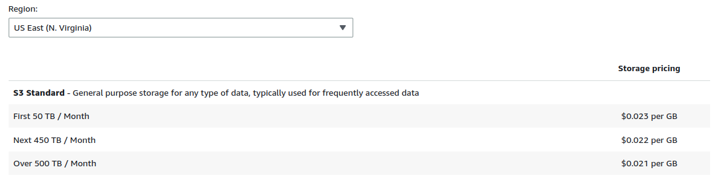
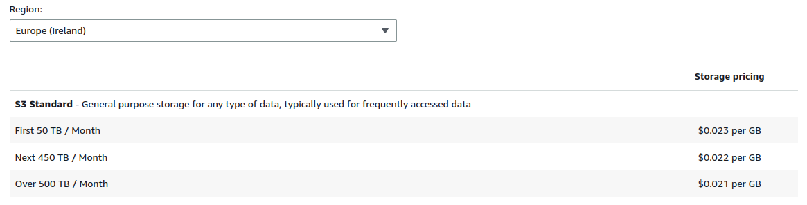
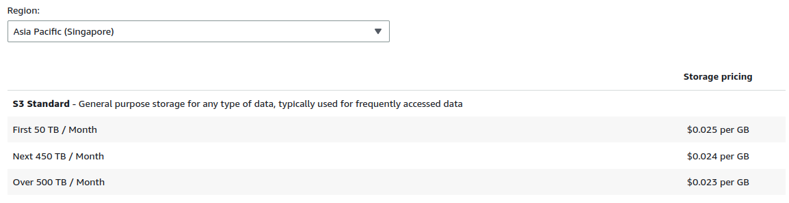
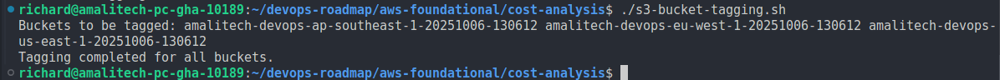
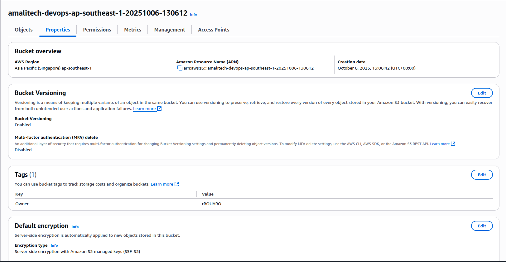

# AWS S3 Storage

Amazon Simple Storage Service (S3) is a highly scalable, reliable, and low-latency data storage infrastructure designed to make web-scale computing easier for developers. This document analyzes S3 costs across three regions used in the multi-region deployment lab: **us-east-1**, **eu-west-1**, and **ap-southeast-1**.

## AWS S3 Storage Classes

AWS S3 offers multiple storage classes designed for different use cases and access patterns:

### S3 Standard

-  **Use Case:** Frequently accessed data
-  **Features:** High durability, availability, and performance
-  **Minimum Storage Duration:** None
-  **Retrieval Fees:** None

### S3 Standard-Infrequent Access (Standard-IA)

-  **Use Case:** Long-lived, infrequently accessed data
-  **Features:** Lower storage cost than Standard, but retrieval fees apply
-  **Minimum Storage Duration:** 30 days
-  **Retrieval Fees:** Per GB retrieved

### S3 One Zone-Infrequent Access (One Zone-IA)

-  **Use Case:** Infrequently accessed, non-critical data
-  **Features:** 20% less cost than Standard-IA, single AZ storage
-  **Minimum Storage Duration:** 30 days
-  **Retrieval Fees:** Per GB retrieved

### S3 Glacier Instant Retrieval

-  **Use Case:** Archive data with instant retrieval needs
-  **Features:** Millisecond retrieval, lower storage costs
-  **Minimum Storage Duration:** 90 days
-  **Retrieval Fees:** Per GB retrieved

### S3 Glacier Flexible Retrieval

-  **Use Case:** Archive data with flexible retrieval (minutes to hours)
-  **Features:** Very low storage costs, configurable retrieval times
-  **Minimum Storage Duration:** 90 days
-  **Retrieval Fees:** Based on retrieval speed

### S3 Glacier Deep Archive

-  **Use Case:** Long-term archive and digital preservation
-  **Features:** Lowest cost storage, 12-hour default retrieval
-  **Minimum Storage Duration:** 180 days
-  **Retrieval Fees:** Per GB retrieved

### S3 Intelligent-Tiering

-  **Use Case:** Data with unknown or changing access patterns
-  **Features:** Automatically moves data between access tiers
-  **Minimum Storage Duration:** None
-  **Retrieval Fees:** None (monitoring fees apply)

## AWS S3 Pricing

AWS S3 pricing consists of several components that vary by region:

### Pricing Components

1. **Storage Costs**

   -  Charged per GB per month
   -  Varies by storage class and region
   -  Tiered pricing (first 50TB, next 450TB, etc.)

2. **Request Costs**

   -  PUT, COPY, POST, LIST requests
   -  GET, SELECT, and other requests
   -  DELETE and CANCEL requests (free)

3. **Data Transfer Costs**

   -  Data transfer IN: Free
   -  Data transfer OUT: Charged per GB
   -  Inter-region transfer: Charged per GB

4. **Management and Analytics**
   -  S3 Storage Lens
   -  S3 Object Tagging
   -  S3 Inventory

### Regional Pricing Variations

Pricing varies by AWS region due to:

-  Infrastructure and operational costs
-  Local market conditions
-  Data center efficiency and scale
-  Network connectivity costs
-  Regulatory and compliance requirements

**Note:** This analysis focuses on **S3 Standard** storage class.

---

## 1. Standard S3 Storage Pricing for Selected Regions

### 1.1 Storage Costs (**us-east-1**, **eu-west-1**, **ap-southeast-1**)

| Region                       | Region Code    | Price per GB/Month | Price per TB/Month |
| ---------------------------- | -------------- | ------------------ | ------------------ |
| **US East (N. Virginia)**    | us-east-1      | $0.023             | $23.00             |
| **EU West (Ireland)**        | eu-west-1      | $0.023             | $23.00             |
| **Asia Pacific (Singapore)** | ap-southeast-1 | $0.025             | $25.00             |

_Pricing as of October 2025 - Subject to AWS pricing changes_

**US East (N. Virginia) Pricing**



**EU West (Ireland) Pricing**



**Asia Pacific (Singapore) Pricing**



### 1.2 Request Pricing for Selected Regions (**us-east-1**, **eu-west-1**, **ap-southeast-1**)

| Request Type              | us-east-1                  | eu-west-1                  | ap-southeast-1             |
| ------------------------- | -------------------------- | -------------------------- | -------------------------- |
| **PUT, COPY, POST, LIST** | $0.0005 per 1,000 requests | $0.0005 per 1,000 requests | $0.0005 per 1,000 requests |
| **GET, SELECT**           | $0.0004 per 1,000 requests | $0.0004 per 1,000 requests | $0.0004 per 1,000 requests |
| **DELETE, CANCEL**        | Free                       | Free                       | Free                       |

---

## 2. Estimated Monthly Cost for Storing 100GB

### 2.1 Storage Cost Calculation (**us-east-1**, **eu-west-1**, **ap-southeast-1**)

Calculation: 100GB × Price per GB/Month

| Region             | Calculation    | Monthly Storage Cost |
| ------------------ | -------------- | -------------------- |
| **us-east-1**      | 100GB × $0.023 | **$2.30**            |
| **eu-west-1**      | 100GB × $0.023 | **$2.30**            |
| **ap-southeast-1** | 100GB × $0.025 | **$2.50**            |

### 2.2 Other Price Differences Observed

**Regional Storage Cost Variations:**

-  ap-southeast-1 is 8.7% more expensive than us-east-1 and eu-west-1 (+$0.002/GB)
-  us-east-1 and eu-west-1 have identical pricing ($0.023/GB)
-  ap-southeast-1 is 8.7% more expensive than eu-west-1 (+$0.002/GB)

**Internet Data Transfer Variations:**

-  ap-southeast-1 has 33% higher egress costs ($0.12/GB vs $0.09/GB for other regions)

### 2.3 Annual Cost Projection (100GB)

| Region             | Monthly Cost | Annual Cost | Savings vs Most Expensive |
| ------------------ | ------------ | ----------- | ------------------------- |
| **us-east-1**      | $2.325       | **$27.90**  | $2.40 (8.6% savings)      |
| **eu-west-1**      | $2.325       | **$27.90**  | $2.40 (8.6% savings)      |
| **ap-southeast-1** | $2.525       | **$30.30**  | - (Most expensive)        |

---

## 3. Data Transfer Costs Between Regions

### 3.1 Inter-Region Data Transfer Pricing

**Data Transfer OUT from S3 to other AWS regions:**

| Source Region      | Destination    | Price per GB |
| ------------------ | -------------- | ------------ |
| **us-east-1**      | eu-west-1      | $0.02        |
| **us-east-1**      | ap-southeast-1 | $0.02        |
| **eu-west-1**      | us-east-1      | $0.02        |
| **eu-west-1**      | ap-southeast-1 | $0.02        |
| **ap-southeast-1** | us-east-1      | $0.02        |
| **ap-southeast-1** | eu-west-1      | $0.02        |

### 3.2 Data Transfer Cost Examples

**Scenario: 10GB monthly replication between regions**

| Transfer Route             | Monthly Data | Transfer Cost | Annual Cost |
| -------------------------- | ------------ | ------------- | ----------- |
| us-east-1 → eu-west-1      | 10GB         | $0.20         | $2.40       |
| us-east-1 → ap-southeast-1 | 10GB         | $0.20         | $2.40       |
| eu-west-1 → ap-southeast-1 | 10GB         | $0.20         | $2.40       |

**Note:** Data transfer IN to S3 from other AWS regions is free.

### 3.3 Internet Data Transfer Costs

**Data Transfer OUT to Internet:**

| Region             | First 1GB/month | Next 9.999TB/month | Next 40TB/month |
| ------------------ | --------------- | ------------------ | --------------- |
| **us-east-1**      | Free            | $0.09/GB           | $0.085/GB       |
| **eu-west-1**      | Free            | $0.09/GB           | $0.085/GB       |
| **ap-southeast-1** | Free            | $0.12/GB           | $0.085/GB       |

---

## 4. Pricing Differences Analysis

### 4.1 Regional Price Variations

**Storage Cost Differences:**

```
ap-southeast-1 vs us-east-1: +8.7% (+$0.002/GB)
eu-west-1 vs us-east-1: 0% (identical pricing: $0.023/GB)
ap-southeast-1 vs eu-west-1: +8.7% (+$0.002/GB)
```

### 4.2 Factors Contributing to Regional Pricing Differences

1. **Infrastructure Costs**

   -  Land and facility costs vary by region
   -  Energy costs and availability
   -  Local regulatory requirements

2. **Market Competition**

   -  us-east-1 has the highest competition and longest AWS presence
   -  Mature infrastructure allows for lower costs

3. **Data Center Efficiency**

   -  us-east-1 benefits from economies of scale
   -  Newer regions may have higher operational costs

4. **Internet Connectivity**
   -  ap-southeast-1 has higher internet egress costs ($0.12/GB  vs  $0.09/GB)
   -  Reflects regional internet infrastructure costs

### 4.3 Cost Optimization Recommendations

**For Multi-Region Deployments:**

1. **Primary Region Selection**

   -  Use **us-east-1** for primary storage (lowest cost)
   -  Consider latency requirements vs. cost savings

2. **Data Transfer Optimization**

   -  Minimize cross-region replication frequency
   -  Use CloudFront for content delivery instead of direct S3 access
   -  Consider AWS DataSync for efficient data transfer

3. **Storage Class Optimization**
   -  Use S3 Intelligent-Tiering for varying access patterns
   -  Consider S3 Standard-IA for infrequently accessed data
   -  Implement lifecycle policies to transition to cheaper storage classes

---

## 5. Lab Implementation Cost Analysis

### 5.1 Current Lab Deployment Costs

**Based on the bucket deployment:**

-  **Buckets Created:** 3 (one per region)
-  **Expected Usage:** Minimal (lab environment)
-  **Storage:** < 1GB total across all regions

**Estimated Monthly Lab Costs:**

```
us-east-1:        $0.023 (minimal storage + requests)
eu-west-1:        $0.023 (minimal storage + requests)
ap-southeast-1:   $0.025 (minimal storage + requests)
Total:            ~$0.071/month
```

---

## 6. Monitoring and Cost Control Recommendations

### 6.1 AWS Cost Management Tools

1. **AWS Cost Explorer**

   -  Track S3 costs by region and service
   -  Set up cost alerts for budget overruns

2. **S3 Storage Lens**

   -  Analyze storage usage patterns
   -  Identify optimization opportunities

3. **CloudWatch Metrics**
   -  Monitor request patterns
   -  Track data transfer volumes

### 6.2 Tagging S3 Buckets with Appropriate Metadata

**S3 buckets tagging script** → [`s3-bucket-tagging.sh/`](s3-bucket-tagging.sh/)



**Screenshot of Tagged S3 Buckets**



---

## 7. Key Findings and Recommendations

**Findings:**

-  **us-east-1** (N. Virginia) and **eu-west-1** (Ireland) offer identical storage costs at $0.023/GB/month
-  **ap-southeast-1** (Singapore) has the highest costs at $0.025/GB/month (+8.7% vs us-east-1/eu-west-1)
-  Data transfer between regions can significantly impact total costs for multi-region architectures
-  No cost difference between us-east-1 and eu-west-1 for storage

**Recommendations:**

-  Use us-east-1 or eu-west-1 as primary regions for cost optimization (identical pricing)
-  Consider regional data transfer costs in architecture decisions
-  Implement proper tagging and monitoring for cost control

---

## 8. Sources and References

1. **AWS S3 Pricing:** https://aws.amazon.com/s3/pricing/
2. **AWS Data Transfer Pricing:** https://aws.amazon.com/ec2/pricing/on-demand/#Data_Transfer
3. **S3 Storage Classes:** https://aws.amazon.com/s3/storage-classes/
4. **AWS Cost Management:** https://aws.amazon.com/aws-cost-management/
5. **S3 Storage Lens:** https://aws.amazon.com/s3/storage-lens/
6. **AWS Pricing Calculator:** https://calculator.aws/
