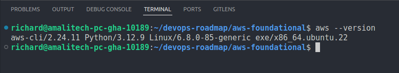
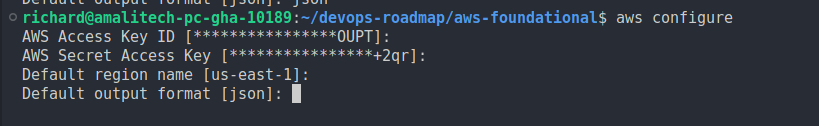
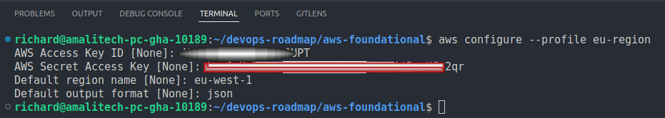
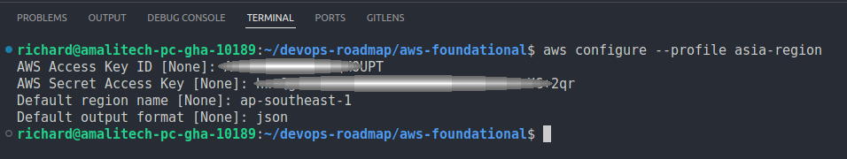
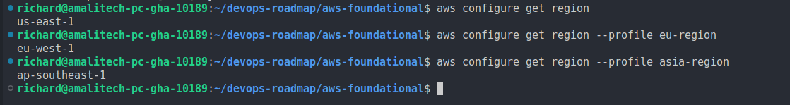

## Part 1: Environment Setup
This document outlines the completed environment setup tasks for AWS CLI configuration and multi-region profile management.

### Task 1.1: Installing and verifying AWS CLI v2

**Objective:** Install AWS CLI v2 and verify successful installation

**Steps Completed:**

1. Downloaded and installed AWS CLI v2 for Linux operating system
2. Verified installation using the `--version` flag
3. Confirmed AWS CLI v2 is properly installed and accessible

**Verification:**

-  Command used: `aws --version`
-  Screenshot: `verify-aws-cli-v2-installation.png`



The installation was successful, showing AWS CLI version 2.x with Python support.

### Task 1.2: Configuring primary AWS CLI profile

**Objective:** Set up the default AWS CLI profile with proper credentials and configuration

**Configuration Details:**

-  **Default Region:** us-east-1
-  **Output Format:** JSON
-  **Credentials:** Configured with appropriate AWS Access Key ID and Secret Access Key

**Steps Completed:**

1. Executed `aws configure` command
2. Entered AWS credentials (Access Key ID and Secret Access Key)
3. Set default region to `us-east-1`
4. Set output format to `json`

**Verification:**

-  Screenshot: `primary-aws-cli-profile.png`



The primary profile is now configured and ready for use with us-east-1 as the default region.

### Task 1.3: Creating named profiles for additional regions

**Objective:** Create additional AWS CLI profiles for multi-region operations

**Profiles Created:**

#### 1. EU Region Profile

-  **Profile Name:** `eu-region`
-  **Region:** eu-west-1
-  **Output Format:** JSON
-  **Command Used:** `aws configure --profile eu-region`

**Screenshot:** `eu-region-aws-cli-config.png`



#### 2. Asia Region Profile

-  **Profile Name:** `asia-region`
-  **Region:** ap-southeast-1
-  **Output Format:** JSON
-  **Command Used:** `aws configure --profile asia-region`

**Screenshot:** `asia-region-aws-cli-config.png`



#### Profile Overview

All configured profiles can be viewed and managed through the AWS CLI profiles system.

**Screenshot:** `aws-cli-profiles.png`



### Summary

**Completed Tasks:**

-  ✅ **Task 1.1:** AWS CLI v2 successfully installed and verified
-  ✅ **Task 1.2:** Primary AWS profile configured with us-east-1 region and JSON output
-  ✅ **Task 1.3:** Additional named profiles created:
   -  `eu-region` profile for eu-west-1
   -  `asia-region` profile for ap-southeast-1

**Key Commands Used:**

```bash
# Verify AWS CLI installation
aws --version

# Configure default profile
aws configure

# Configure named profiles
aws configure --profile eu-region
aws configure --profile asia-region
```

**Regional Configuration:**

-  **Default Profile:** us-east-1 (Primary)
-  **EU Region Profile:** eu-west-1
-  **Asia Region Profile:** ap-southeast-1

The environment is now properly set up for multi-region AWS operations using different profiles. All profiles are configured with JSON output format for consistent data handling and parsing in automation scripts.