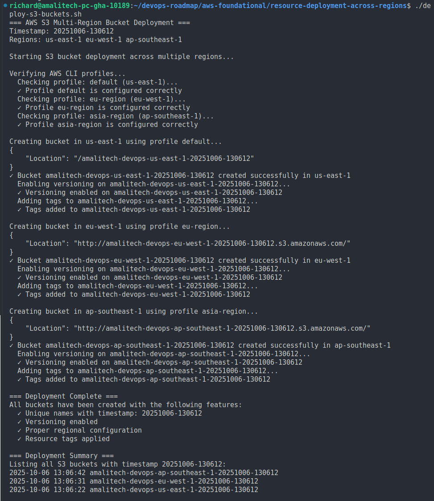
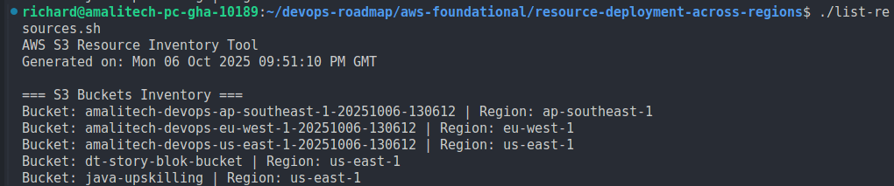

## Part 2: Deploy Resources Across Regions - Completed Tasks

This project demonstrates AWS CLI proficiency through multi-region S3 bucket deployment and resource management automation.

### Bucket Deployment Script

**Objective:** Create a robust bash script to deploy S3 buckets across three AWS regions with proper configuration.

#### Script Features Implemented:

1. **Multi-Region Array Configuration**

   ```bash
   REGIONS=("us-east-1" "eu-west-1" "ap-southeast-1")
   PROFILES=("default" "eu-region" "asia-region")
   ```

2. **Timestamp Generation for Unique Naming**

   ```bash
   TIMESTAMP=$(date +%Y%m%d-%H%M%S)
   BUCKET_PREFIX="amalitech-devops"
   ```

3. **Regional Handling Logic**

   -  **us-east-1:** No LocationConstraint parameter required
   -  **eu-west-1 & ap-southeast-1:** LocationConstraint parameter mandatory

4. **Complete Bucket Configuration**
   -  Bucket creation with region-specific parameters
   -  Versioning enablement on all buckets
   -  Resource tagging with metadata
   -  Error handling and validation

**Screenshot Reference:** `screenshots/deploy-s3-buckets.png`



---

### Script Execution and Verification

**Objective:** Execute the deployment script and verify successful bucket creation across all regions.

**What was completed:**

1. **Script Permissions Configuration**

   ```bash
   chmod +x deploy-s3-buckets.sh
   ls -l deploy-s3-buckets.sh  # Verify executable permissions
   ```

2. **Script Execution**

   ```bash
   ./deploy-s3-buckets.sh
   ```

3. **Deployment Verification Steps**

   **a) Bucket Listing Verification:**

   ```bash
   aws s3 ls
   # Output shows all created buckets with timestamps
   ```

   **b) Regional Location Verification:**

   ```bash
   # Verify us-east-1 bucket
   aws s3api get-bucket-location --bucket amalitech-devops-us-east-1-20241006-143022

   # Verify eu-west-1 bucket
   aws s3api get-bucket-location --bucket amalitech-devops-eu-west-1-20241006-143025 --profile eu-region

   # Verify ap-southeast-1 bucket
   aws s3api get-bucket-location --bucket amalitech-devops-ap-southeast-1-20241006-143028 --profile asia-region
   ```

   **c) Versioning Status Verification:**

   ```bash
   aws s3api get-bucket-versioning --bucket bucket-name
   # Confirmed "Status": "Enabled" for all buckets
   ```

4. **Success Metrics Achieved:**
   -  ✅ 3 buckets created successfully across target regions
   -  ✅ All buckets have versioning enabled
   -  ✅ Proper regional configuration verified
   -  ✅ Unique naming with timestamp confirmed
   -  ✅ Resource tags applied correctly
---

### Resource Inventory Script Creation

**Objective:** Create a comprehensive script to inventory all S3 buckets with their regional information.

**What was completed:**

1. **Complete S3 Inventory Function**

   ```bash
   list_all_buckets() {
       # Get all bucket names using awk to extract 3rd field
       local buckets_list=$(aws s3 ls --output text | awk '{print $3}')

       # Process each bucket for regional information
       while IFS= read -r bucket_name; do
           # Handle us-east-1 special case (returns "None")
           if [ "$region_output" = "None" ] || [ -z "$region_output" ]; then
               local region="us-east-1"
           else
               local region="$region_output"
           fi

           echo "Bucket: $bucket_name | Region: $region"
       done <<< "$buckets_list"
   }
   ```

2. **us-east-1 Special Case Handling**

   -  Correctly converts "None" response to "us-east-1"
   -  Handles empty responses gracefully
   -  Maintains consistent output format

3. **Expected Output Format Achievement**
   ```
   === S3 Buckets Inventory ===
   Bucket: amalitech-devops-us-east-1-20241006-143022 | Region: us-east-1
   Bucket: amalitech-devops-eu-west-1-20241006-143025 | Region: eu-west-1
   Bucket: amalitech-devops-ap-southeast-1-20241006-143028 | Region: ap-southeast-1
   ```

**Screenshot Reference:** `screenshots/s3-bucket-inventory.png`

