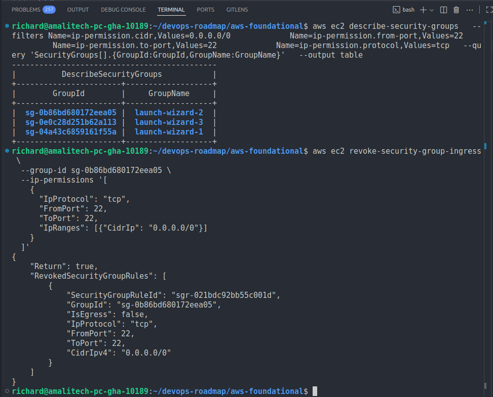
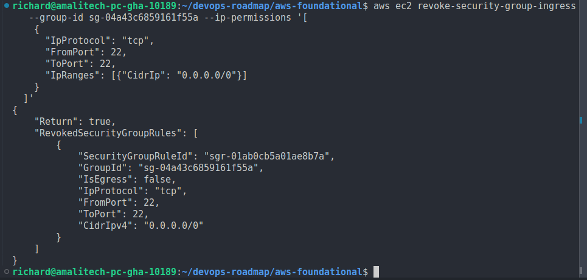
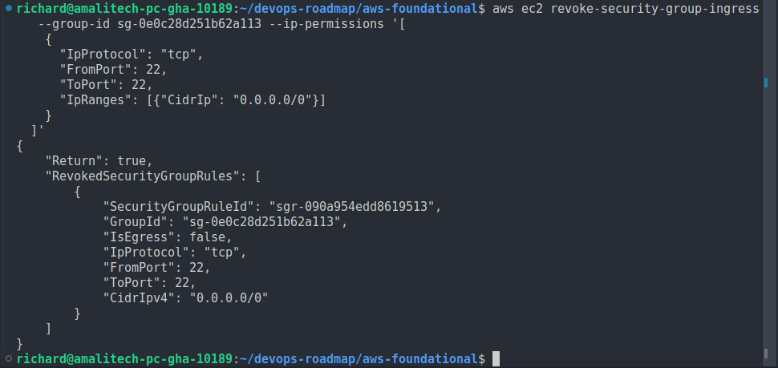
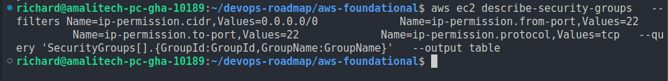
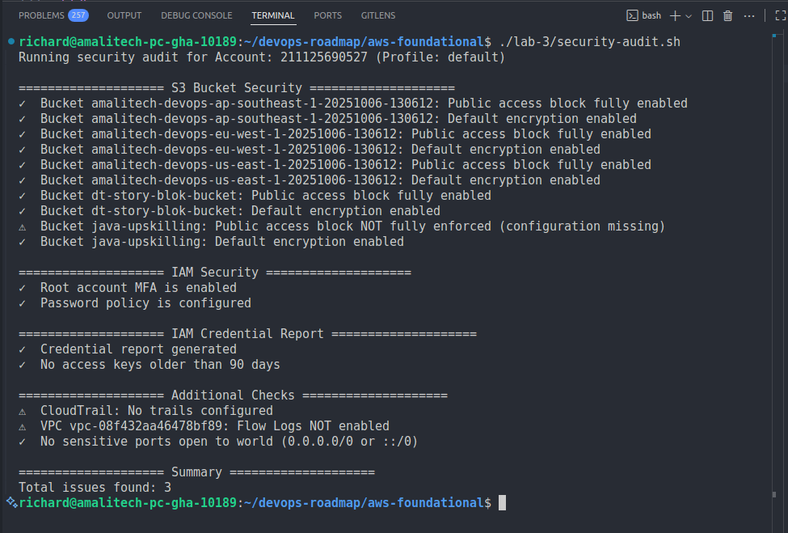
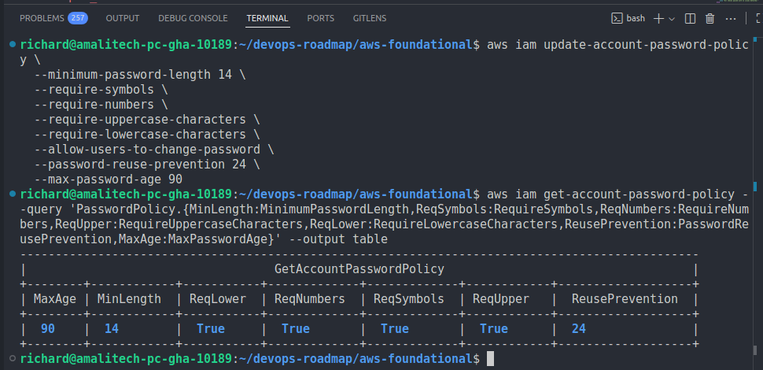

# Remediation for Issue 2 and 3

This document records the concrete remediation actions performed for selected issues from [`remediation-plan.md`](remediation-plan.md).

## Scope of This Execution

Issues addressed in this execution cycle:

1. Issue 2: Security Groups Allow SSH (Port 22) From 0.0.0.0/0
2. Issue 3: IAM Account Password Policy Not Configured


---

## Issue 2 Remediation: SSH (Port 22) Open to the World

### Original Finding (SSH Exposure)

Audit output snippet:

```text
⚠  Security Groups: Port 22 open to the world in 3 group(s)
```

### Objective (SSH Exposure)

Eliminate unrestricted (0.0.0.0/0 or ::/0) SSH ingress and move toward least-privilege access.

### Approach (SSH Exposure)

Revoke global SSH rules from affected security groups and replace with a restricted corporate / admin CIDR (placeholder used below). If SSH no longer required, remove rule entirely.

### Commands Executed (SSH Exposure)

Identify affected groups:

```bash
aws ec2 describe-security-groups \
  --filters Name=ip-permission.cidr,Values=0.0.0.0/0 \
           Name=ip-permission.from-port,Values=22 \
           Name=ip-permission.to-port,Values=22 \
           Name=ip-permission.protocol,Values=tcp \
  --query 'SecurityGroups[].{GroupId:GroupId,GroupName:GroupName}' --output table
```

For each offending group (example `sg-EXAMPLE123`):

```bash
# Remove wide-open SSH ingress
aws ec2 revoke-security-group-ingress \
  --group-id sg-EXAMPLE123 \
  --ip-permissions '[{"IpProtocol":"tcp","FromPort":22,"ToPort":22,"IpRanges":[{"CidrIp":"0.0.0.0/0"}]}]'

# Add restricted CIDR (replace with actual trusted network)
aws ec2 authorize-security-group-ingress \
  --group-id sg-EXAMPLE123 \
  --ip-permissions '[{"IpProtocol":"tcp","FromPort":22,"ToPort":22,"IpRanges":[{"CidrIp":"203.0.113.0/24","Description":"Corp SSH"}]}]'
```

Screenshots:





### Result Verification (SSH Exposure)

Resolved (SSH global exposure removed / restricted).





## Issue 3 Remediation: Missing IAM Account Password Policy

### Original Finding (Password Policy)

Audit output snippet:

```text
⚠  Password policy NOT configured
```

### Objective (Password Policy)

Establish a strong password policy enforcing complexity, minimum length, reuse prevention, rotation (per current governance), and user self-service change.

### Command Executed (Password Policy)

```bash
aws iam update-account-password-policy \
  --minimum-password-length 14 \
  --require-symbols \
  --require-numbers \
  --require-uppercase-characters \
  --require-lowercase-characters \
  --allow-users-to-change-password \
  --password-reuse-prevention 5 \
  --max-password-age 90
```

### Verification (Password Policy)

```bash
aws iam get-account-password-policy --query 'PasswordPolicy.{Min:MinimumPasswordLength,Upper:RequireUppercaseCharacters,Lower:RequireLowercaseCharacters,Num:RequireNumbers,Sym:RequireSymbols,Reuse:PasswordReusePrevention,MaxAge:MaxPasswordAge}' --output table
```

Expected fields confirmed (see embedded screenshot below). Audit re-run produced:

```text
✓  Password policy is configured
```

Screenshots:



### Result (Password Policy)

Status: Resolved (Password complexity & governance enforced).

## Remediation Summary

| Issue | Title                               | Status   | Verification Source                  |
| ----- | ----------------------------------- | -------- | ------------------------------------ |
| 2     | SSH (22) open to world              | Resolved | Updated audit output & SG screenshot |
| 3     | IAM account password policy missing | Resolved | Audit output & password policy query |
